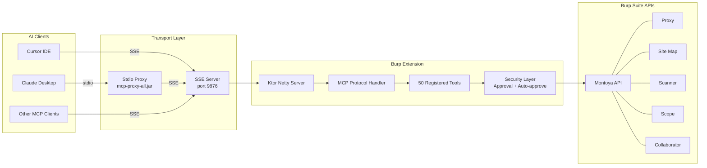

# Architecture

## Overview

The Burp Suite MCP Server (Extended) is a Burp Suite extension that embeds an MCP (Model Context Protocol) server, exposing 50 tools to AI clients like Cursor and Claude Desktop.

## System Diagram



## Transport Layers

### SSE (Server-Sent Events)

The primary transport. The extension starts a Ktor Netty server on a configurable host and port (default `127.0.0.1:9876`). Clients like Cursor connect directly over HTTP using SSE.

### Stdio (via mcp-proxy)

For clients that only support stdio (like Claude Desktop), the extension bundles `mcp-proxy-all.jar`. This proxy runs as a subprocess, accepts stdio on stdin/stdout, and forwards requests to the SSE server over HTTP.

## Source Layout

```
src/main/kotlin/net/portswigger/
    extension/                  Burp Suite extension (plugin layer)
        ExtensionBase.kt        Entry point, wires everything together
        SwingDispatcher.kt      Kotlin coroutine dispatcher for Swing EDT
        providers/              Claude Desktop installer, proxy JAR manager
        ui/                     Config UI panels, design system, dialogs
            components/         Individual UI panels
    mcp/                        MCP server (protocol layer)
        BuildInfo.kt            Version and name constants
        KtorServerManager.kt    Ktor SSE server lifecycle
        ServerManager.kt        Server state machine interface
        config/                 McpConfig persistence
        schema/                 JSON schema generation, serialization DTOs
            JsonSchema.kt       Reflection-based JSON Schema for tool params
            serialization.kt    Burp API to JSON DTO conversions
        security/               Approval handlers for HTTP, history, scanner
            SecurityUtils.kt    Swing frame lookup utilities
        tools/                  All 50 MCP tool definitions
            Tools.kt            Tool registrations and data classes
            McpTool.kt          mcpTool/mcpPaginatedTool DSL
            ScanTaskRegistry.kt Scanner task ID tracking
```

## Key Components

### ExtensionBase

The Burp `BurpExtension` entry point. Creates the `McpConfig`, `KtorServerManager`, providers, and the config UI. Registers the MCP tab in Burp and handles extension unloading.

### KtorServerManager

Manages the Ktor Netty embedded server lifecycle. Starts/stops the SSE server, configures CORS, applies DNS rebinding protections (Origin, Host, Referer, User-Agent checks), and wires up the MCP protocol handler.

### Tools (registerTools)

All 50 tools are registered in `Tools.kt` using the `mcpTool` and `mcpPaginatedTool` DSL. Each tool is a `@Serializable` data class that defines its input parameters. Tool names are auto-derived from the class name in `lower_snake_case`.

### Security Layer

Three approval handlers gate access to sensitive operations:

- **HttpRequestSecurity** - Approves outbound HTTP requests. Supports auto-approve by hostname, host:port, or wildcard (`*.example.com`).
- **HistoryAccessSecurity** - Approves access to proxy HTTP history, WebSocket history, and site map data.
- **ScannerSecurity** - Approves scanner operations (crawls, audits, report generation).

Each handler shows a Swing dialog for user confirmation and supports "Always Allow" options that persist in config.

## Build Artifacts

| Command | Output | Description |
|---------|--------|-------------|
| `./gradlew shadowJar` | `build/libs/burp-mcp-all.jar` | SSE-only build (recommended for Cursor) |
| `./gradlew embedProxyJar` | `build/libs/burp-mcp-all.jar` | SSE + stdio proxy (for Claude Desktop) |

The `embedProxyJar` task first downloads `mcp-proxy-all.jar` from GitHub releases, then embeds it into the shadow JAR so the extension can extract it at runtime.
